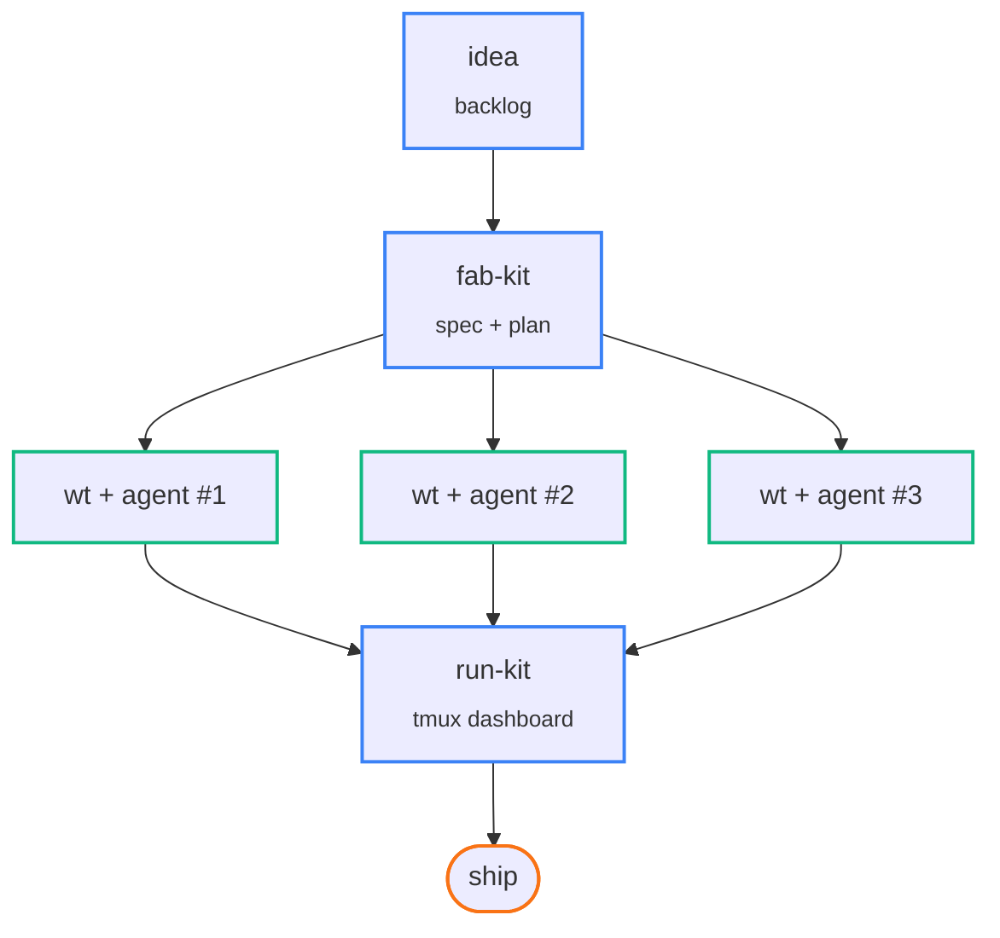
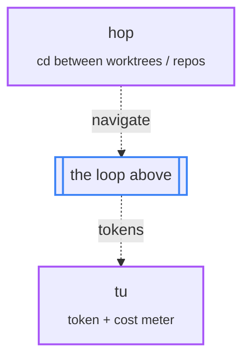

## Hi 👋 — I'm Sahil

CTO of [Noon](https://noon.design). On the side, I'm building open-source AI tooling for developers and designers. We use these daily at Noon.

Small Go CLIs that compose into a **Complete AI Coding Workflow**:

```txt
spec → parallel agent sessions → ship
```

No SDK, no vendor lock-in, no opinions you can't override.

This page ([ai.shll.in](https://ai.shll.in)) is the canonical home for everything below.

### Install everything

```bash
brew install sahil87/tap/all   # installs every tool in the toolkit
shll shell-install             # one command to wire shell integration into your rc file
exec $SHELL                    # reload so the integration takes effect
```

Later, `shll update` upgrades every installed tool in one go. See the [shll README](https://github.com/sahil87/shll) for the full command surface.

### How the tools fit together

One idea fans out into many parallel agent sessions — then converges into a single dashboard you can watch from your phone.



**The loop:** `idea` captures it · `fab-kit` turns it into a spec the AI can't fudge · `wt` spins up an isolated worktree per change so N agents work in parallel without conflicts · `run-kit` gives you one browser tab to watch them all (mobile-friendly via Tailscale).

<details>
<summary>The full picture — how <code>hop</code> and <code>tu</code> wrap the loop</summary>



**Wrapping it:** `hop` jumps you into any worktree (or across repos) in one keystroke · `tu` tracks what all those parallel agents are costing you in tokens · `shll` keeps everything installed and updated.

</details>

### Tools

| Tool | One-liner |
|------|-----------|
| [**fab-kit**](https://github.com/sahil87/fab-kit) | 7-stage pipeline that forces AI agents to plan before they code. Works with Claude Code, Codex, Cursor, Windsurf. |
| [**wt**](https://github.com/sahil87/wt) | Opinionated `git worktree` wrapper — one worktree per change, one AI session per worktree, zero conflicts. |
| [**idea**](https://github.com/sahil87/idea) | Plain-Markdown backlog (`fab/backlog.md`) — worktree-aware, queryable from the CLI, feeds `/fab-new`. |
| [**run-kit**](https://github.com/sahil87/run-kit) | Browser dashboard for tmux + Claude Code workspaces. Mobile-friendly via Tailscale. |
| [**hop**](https://github.com/sahil87/hop) | Fuzzy-nav, batch-git, and run-anything-inside-any-repo from one `hop.yaml` config. |
| [**tu**](https://github.com/sahil87/tu) | Token/cost tracker for Claude Code, Codex, OpenCode. Multi-machine sync, live watch mode. |
| [**shll**](https://github.com/sahil87/shll) | Meta-CLI — `shll install / update / shell-install` to wire and maintain the whole toolkit. |

### Install individually

Or pick individual formulas from [`sahil87/homebrew-tap`](https://github.com/sahil87/homebrew-tap):

```bash
brew install sahil87/tap/<formula>
```

### Community

Questions, feature requests, or just want to chat about AI dev tooling? **[Join the Discord](https://discord.gg/32XHh5mJYn)** — that's where I answer queries, share what I'm building, and discuss with people using these tools.

### Find me

[LinkedIn](https://in.linkedin.com/in/ahujasahil) · [X](https://x.com/_sahilahuja) · [Discord](https://discord.gg/32XHh5mJYn) · [ai.shll.in](https://ai.shll.in)
